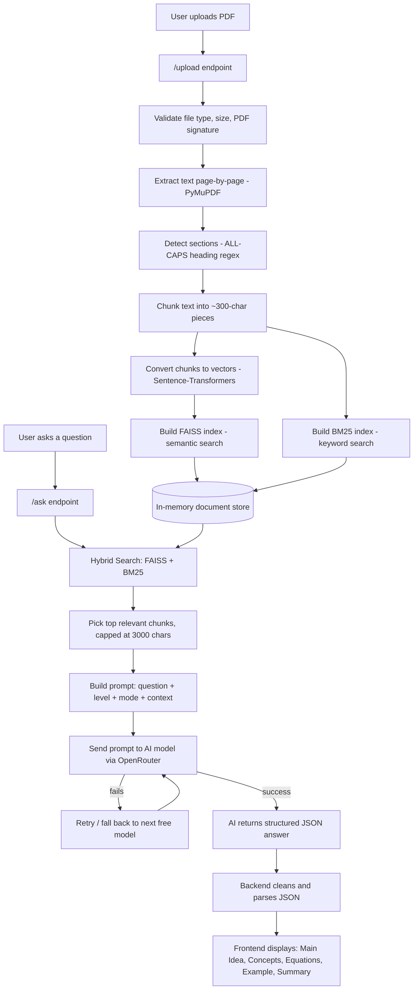

# ClarifyAI: RAG-Based PDF Question Answering System

> Upload any PDF, ask questions in plain English, and get clear, structured answers — explained at the level *you* choose (beginner, student, or expert).

---

## 🧠 Overview

**ClarifyAI** is a **RAG (Retrieval-Augmented Generation)** web app that lets you "talk" to any PDF. Instead of reading a long research paper, contract, or textbook yourself, you upload it and ask questions in plain English.

Under the hood, the app reads the PDF, breaks it into small searchable pieces, finds the pieces most relevant to your question, and sends them — along with your question — to a free AI model. The model answers **using only the content of your document**, and never guesses beyond it. If the answer isn't there, it clearly says *"Not found in the document."*

You can also pick **how the answer is explained** — like a 10-year-old, a college student, or a researcher — and the same document will be explained differently depending on your choice.

---

## ## 🛠 Tech Stack (Explained Simply)

| Technology | Role | Simple Explanation |
|---|---|---|
| **Python** | Language | The language the whole project is written in |
| **FastAPI** | Backend/Server | The "waiter" — handles requests from your browser (upload PDF, ask question) and sends back answers |
| **Uvicorn** | Server Engine | Runs FastAPI and keeps the website live |
| **PyMuPDF (`fitz`)** | PDF Reader | Opens the PDF and extracts all its text, page by page |
| **Sentence-Transformers** | Meaning Search | Converts text into number-based "vectors" that capture meaning |
| **FAISS** | Semantic Search | Finds text chunks closest in *meaning* to your question |
| **rank-bm25** | Keyword Search | Finds text chunks with the most *matching words* (like smart Ctrl+F) |
| **OpenRouter + OpenAI SDK** | AI Brain | Sends your question + relevant text to a free AI model and gets back the answer |
| **HTML / CSS / JavaScript** | Frontend | Builds and powers the chat-style webpage you interact with |
| **python-dotenv** | Security | Keeps your API key hidden safely in a `.env` file |
| **numpy** | Math Helper | Handles number crunching behind the vector search |

> **In short:** FastAPI runs the app, PyMuPDF reads the PDF, Sentence-Transformers + FAISS + BM25 find the right content (hybrid search), and OpenRouter's AI writes the final answer — all shown on a simple HTML/CSS/JS webpage.

---

## 🏗 Project Architecture / Workflow

ClarifyAI follows a classic **RAG (Retrieve → Augment → Generate)** pipeline.



**In short:**
1. PDF is uploaded → validated → text extracted → split into sections → split into small chunks.
2. Chunks are indexed two ways: by *meaning* (FAISS) and by *keywords* (BM25).
3. When you ask a question, both indexes are searched and merged ("hybrid search").
4. The best matching chunks + your question + chosen level/mode are packed into a prompt.
5. The prompt is sent to a free AI model (with automatic fallback if one fails).
6. The AI's structured JSON answer is cleaned up and shown in the chat UI.

---

## ⚙️ Setup & installation

### 1. Get an OpenRouter API key
Sign up at [openrouter.ai/keys](https://openrouter.ai/keys) and copy your key.

### 2. Clone / open the project
```bash
cd ClarifyAI
```

### 3. Create a virtual environment
```bash
python -m venv venv

# Windows
venv\Scripts\activate

# macOS / Linux
source venv/bin/activate
```

### 4. Add your API key
Create a `.env` file in the project root:
```
OPENROUTER_API_KEY=sk-or-v1-xxxxxxxxxxxxxxxxxx
```

### 5. Install dependencies
```bash
pip install -r requirements.txt
```
The first run downloads the embedding model (~90 MB) — one-time only, cached afterward.

### 6. Run the server
```bash
uvicorn main:app --reload
```

### 7. Open the app
Visit **http://localhost:8000**

---

## 📥📤 Input & Output

**Input:**
- A PDF file (text-based, not scanned), maximum **20 MB**
- A question in plain English
- Explanation level: `10 year old` (Beginner) / `college student` (Student, default) / `researcher` (Expert)
- Mode (optional): `normal` (default) / `equation` / `analysis`

**Output:**
A structured JSON answer shown in the chat window:

| Field | Description |
|---|---|
| `main_idea` | The core answer in 1–2 sentences |
| `key_concepts` | Important terms, each with a short explanation |
| `equations_explained` | Plain-language explanation of any equations, or `N/A` |
| `real_world_example` | A concrete real-life example, or `N/A` |
| `simple_summary` | One memorable summary sentence |

If the document doesn't contain the answer, the AI responds with **"Not found in the document"** instead of guessing.

---

## 🧩 Core Algorithms (Explained Simply)

**1. Section Detection**
Scans each page for lines written in ALL CAPS (like `INTRODUCTION` or `RESULTS`) using a regex pattern, and treats the text between two such headings as one "section." No headings found → the whole page becomes one `GENERAL` section.

**2. Semantic Chunking**
Splits section text into small chunks of about 300 characters, but only cuts at the end of a full sentence (after `.`, `!`, or `?`) — so no sentence is ever cut in half.

**3. Hybrid Search (Semantic + Keyword)**
When you ask a question:
- **FAISS (semantic)** turns your question into a vector and finds chunks whose *meaning* is closest — catching paraphrased or related content even if the wording differs.
- **BM25 (keyword)** finds chunks sharing the most *exact words* with your question — catching specific terms, names, or numbers.
- The two result sets are merged and de-duplicated, giving broader, more reliable coverage than either method alone.

**4. Multi-Model AI Fallback**
Free AI models can occasionally be slow or rate-limited. ClarifyAI keeps a prioritized list of four free OpenRouter models and tries them one by one — if a model fails or returns nothing, it briefly waits and moves to the next model, making the app more resilient without needing a paid key.

---

## 📦 Dependencies

| Package | Purpose |
|---|---|
| `fastapi` | Web framework / API server |
| `uvicorn` | ASGI server to run the FastAPI app |
| `pymupdf` | Reads and extracts text from PDF files |
| `faiss-cpu` | Vector similarity search (semantic search engine) |
| `sentence-transformers` | Generates text embeddings locally |
| `python-multipart` | Enables file uploads in FastAPI |
| `rank-bm25` | Keyword-based search algorithm (BM25) |
| `numpy` | Numerical operations on embedding vectors |
| `openai` | SDK used to call OpenRouter's OpenAI-compatible API |
| `python-dotenv` | Loads environment variables from `.env` |